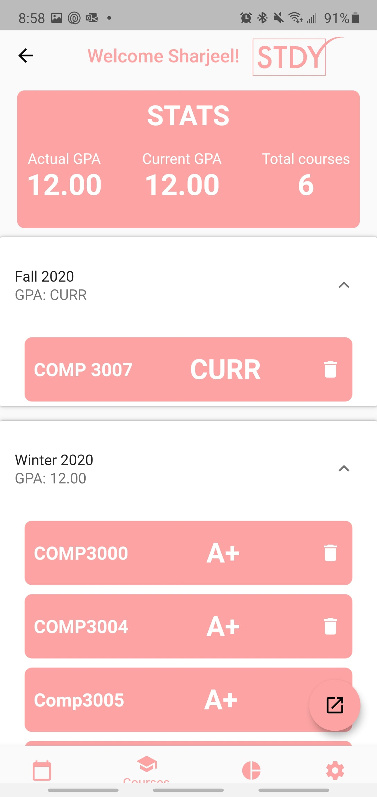

# A schedule and grade tracking app for students

## Contents
1. [Overview](#Overview)
2. [Architecture](#Architecture)
3. [Screenshots](#Screenshots)
4. [Credits](#Credits)

## Overview

An android app that allows students to track their courses by adding various types of tasks such as assignments, tests or readings for their courses. Students have the ability to keep track of their task progress, such as number of hours completed or pages read. Once a task is completed, a student can assign a grade to the task, automatically updating their current course grade and GPA. The app also has a grade predictor, which can be used to predict the grade you need to attain a certain GPA or course grade. 

## Architecture

This app was programmed in Dart using the Flutter SDK in Android Studio for development of Android applications. The database back-end is handled using Google Firebase cloud architecture for storing data and notifications. The calendar itself implements Google Calendar for syncing. 

## Screenshots

## Credits

**Sharjeel Ali**

Roles:
grade tracker and grade predictor, firebase data

**Uzair Irfan**

Roles:
Settings/fonts, notifications

**Minna Amin**

Roles:
statistics and charts

**RC Syed**

Roles:
Scheduling, tasks, statistics and charts, art, firebase data

